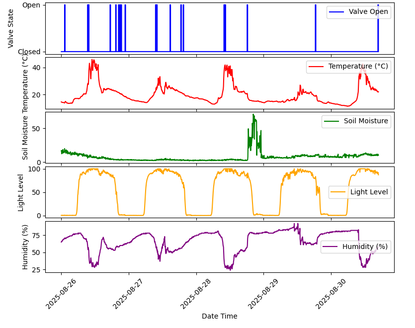
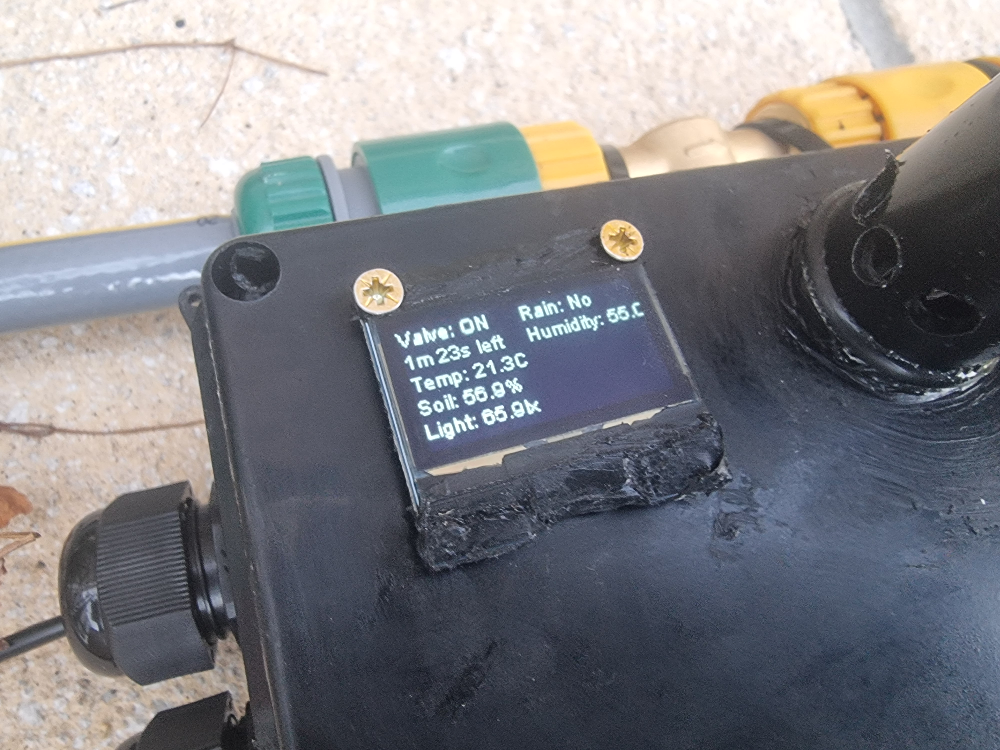
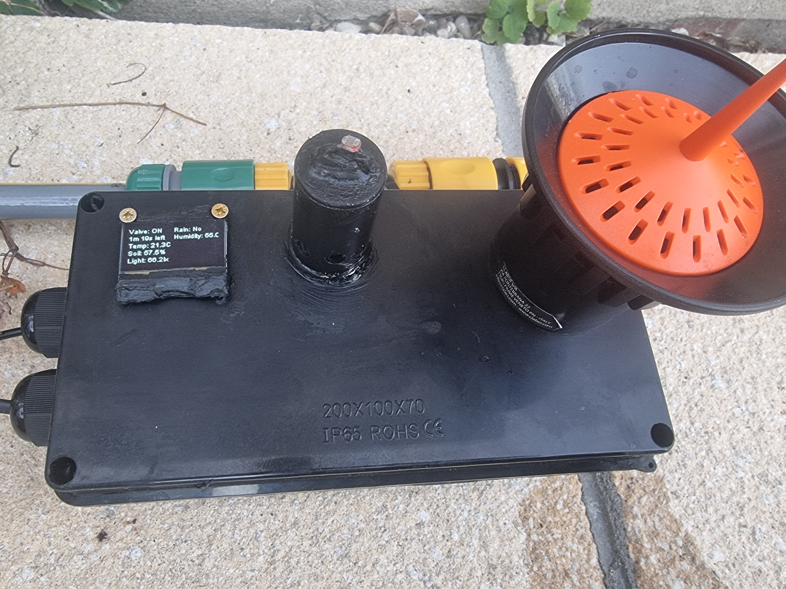
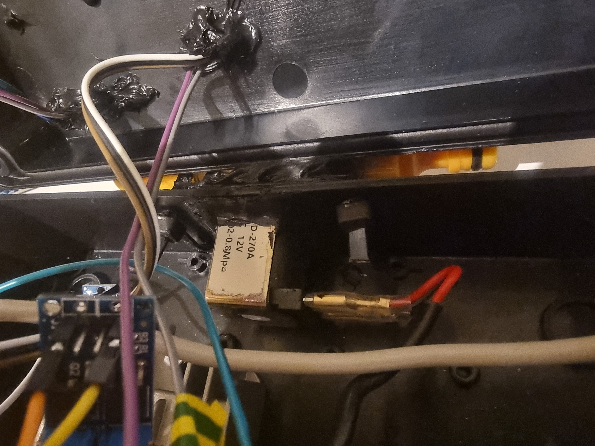
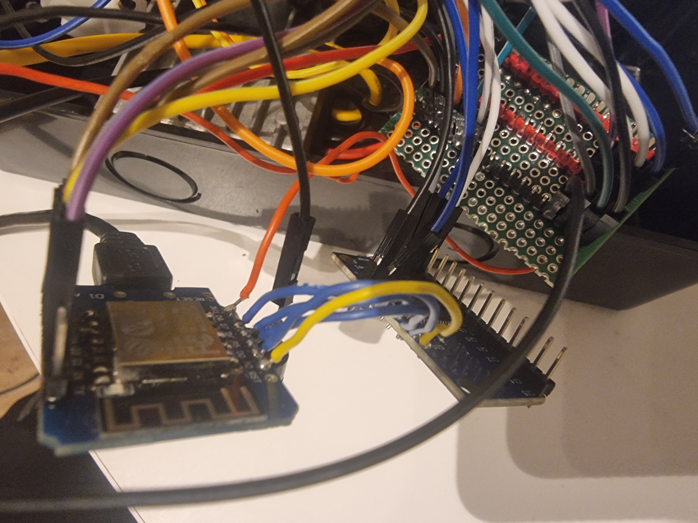
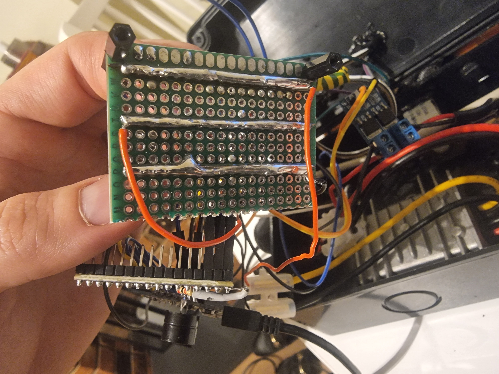
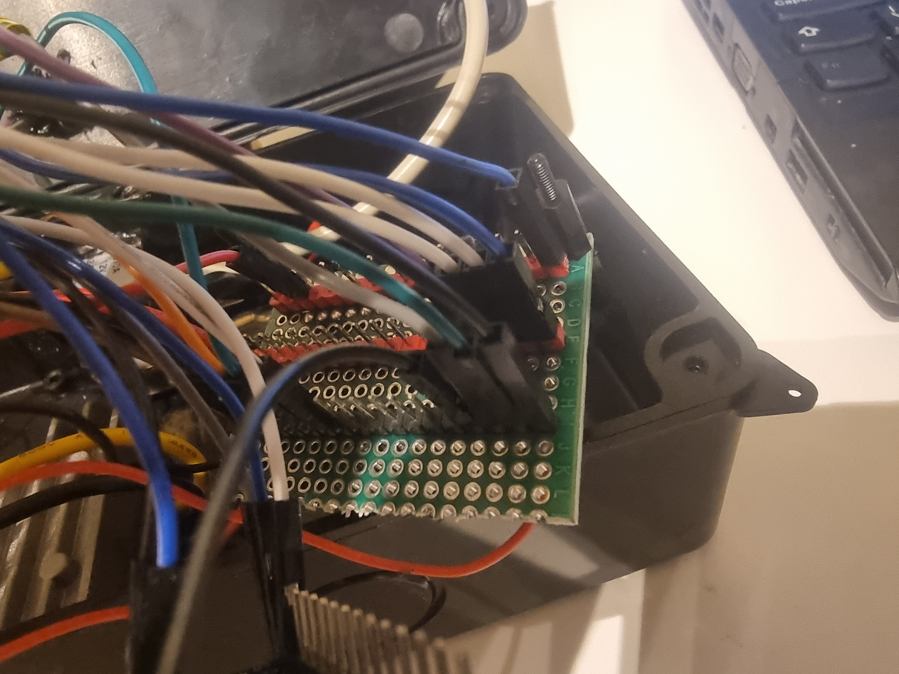
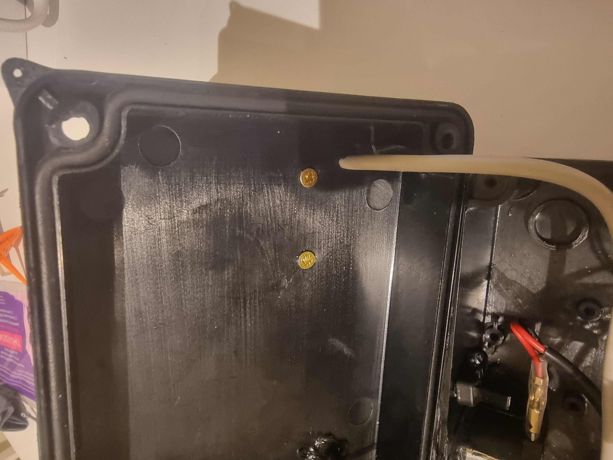
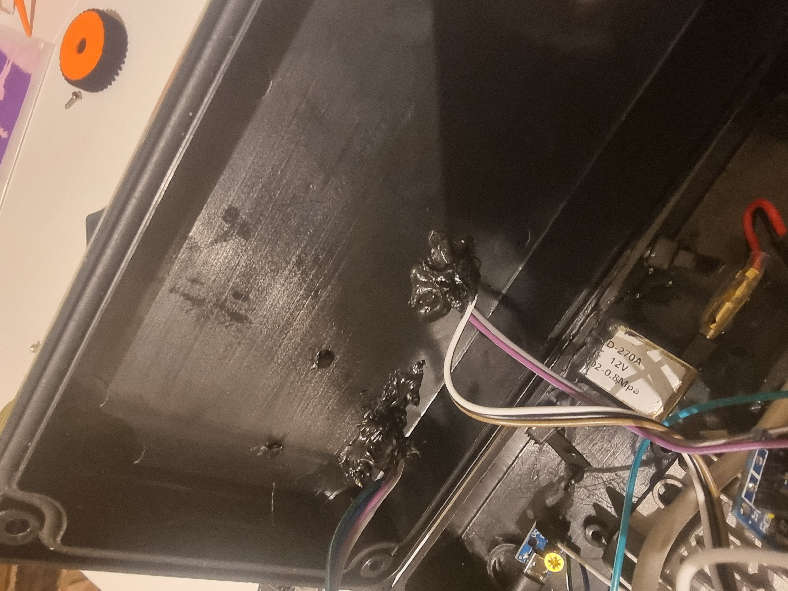
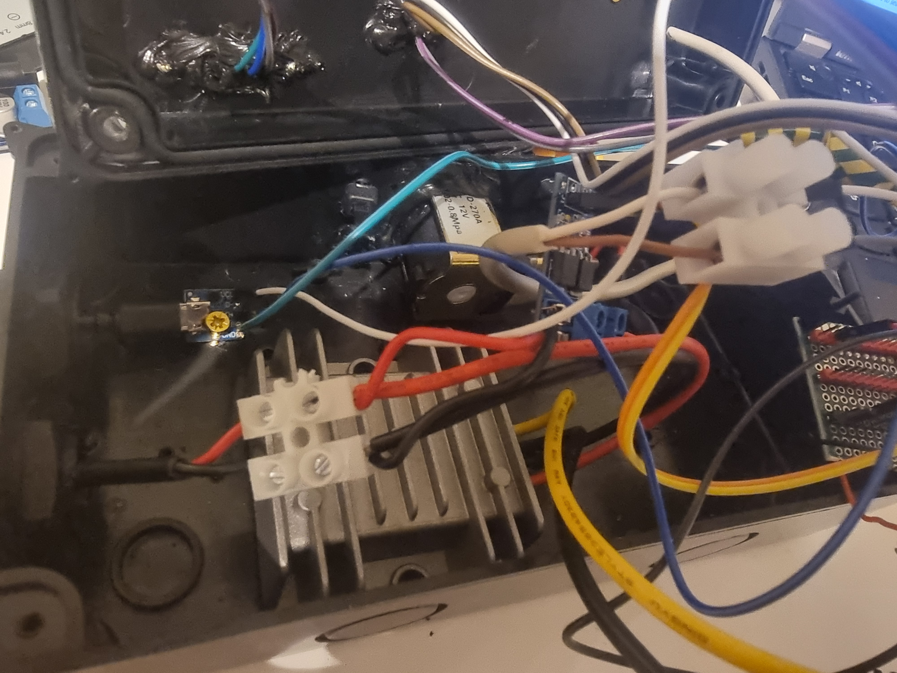

# auto_sprinklers

Device/project that automates watering a lawn. It is integrated with Alexa, it allows to say "Alexa, turn sprinklers on/off" which activates water flow for 10 minutes. It also collects data from different sensors (temperature, humidity, soil moisture, light, rain sensor), but as of 26/08/2025 it does not use this data for determining when to activate water flow. It logs these values every 5 minutes and allows to view them on a graph (on a PC on the same network). This is done by the provided [python script](./offline_analysis_PC_client/offline_analysis_PC_client.py) which retrieves data and plots a graph using data from specific number of days (see `py -3 offline_analysis_PC_client.py --help` for options). My plan is to observe the data for some time and then come up with some reliable automatic method.    

# Used parts

* Wemos D1 Mini  
* 16 to 1 analog multiplexer cd74hc4067 ([documentation link](https://www.ti.com/lit/ds/symlink/cd74hc4067.pdf)) - for reading up to 16 sensors using a single analog pin of the Wemos D1 Mini  
* Solenoid Valve (Hilitand, G3/4, brass, 12V, normally closed) ([amazon link](https://www.amazon.co.uk/dp/B07F5HFDMM)) - controlling water flow  
* SSH1106 I2C OLED display  
* waterproof electical box ([amazon link](https://www.amazon.co.uk/dp/B0DFCSP1KQ)) - for the 12V adapter  
* IP65 junction box (200 x 100 x 70mm, [amazon link](https://www.amazon.co.uk/dp/B09CD8MB6W)) - for the main device itself  
* 12V 10A power adapter ([aliexpress link](https://www.aliexpress.com/item/1005007217303825.html), watch out for ones claiming to support 5A [like this](https://www.amazon.co.uk/dp/B07HRLGV3S), this device had power problems with it)    
* Mosfet module ([amazon link](https://www.amazon.co.uk/dp/B09TTLSRV9)) - for controlling the soleneoid valve (which uses 12V) by using Wemos D1 Mini pin (which outputs 3.3V)  
* Echo dot 5th generation ([amazon link](https://www.amazon.co.uk/dp/B09B96TG33))  
* hose pipe ([amazon link](https://www.amazon.co.uk/dp/B0741FN9FL))  
* hose pipe connectors ([amazon link](https://www.amazon.co.uk/dp/B08ZDC71FP))  
* sprinklers ([amazon link](https://www.amazon.co.uk/dp/B0FCXRCN12))  
* Claber 90915 Rain Sensor ([amazon link](https://www.amazon.co.uk/dp/B000EVNWTQ)) - there are cheaper options but typically with lower rating on amazon  
* cable terminal/connector blocks ([ebay link](https://www.ebay.co.uk/itm/264394503287))  
* 2 core cable ([amazon link](https://www.amazon.co.uk/dp/B0DP8183Z9))  
* 12V to 5V step down converter ([aliexpress link](https://www.aliexpress.com/item/1005006648976219.html))  
* DHT11 temperature and humidity sensor (I used one from Keyes sensors kit)  
* soil moisture sensor (also from Keyes sensors kit)  
* passive buzzer  
* 2 resistors between 2-4.7k ohm (does not matter which exact value is used within this range)  
* photoresistor  
* perfboard  
* solid core wires  
* silicone sealant  
* cable crimps ([amazon link](https://www.amazon.co.uk/dp/B07H4LCNKT)) - not really necessary, the valve can be soldered  

# Schematic 
Open the image in a new tab for a better resolution, pin names are hard to see otherwise.  

(schematic below shows a dodgy 12V to 5V converter which claims to support 5A but doesn't, make sure you get a proper one, [this one](https://www.aliexpress.com/item/1005007217303825.html) worked well)  

# More images

